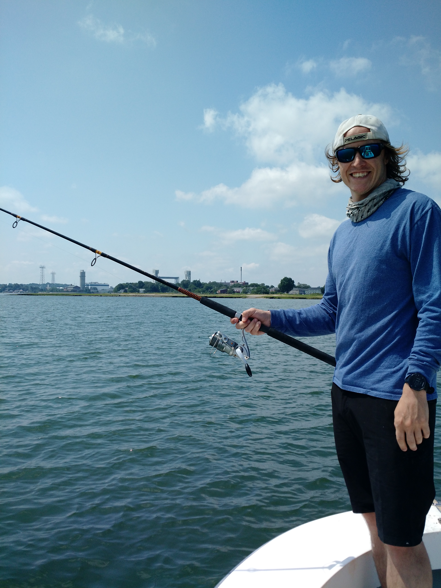

<link rel="stylesheet" href="styles.css" type="text/css">

A full list of my publications is available on [Google scholar](https://scholar.google.com/citations?user=Xsxg0-sAAAAJ&hl=en).

###  Publications

Yung-Chun Z, Moxley JH, Kanive P, Gleiss A, Maughan T, Bird L, Jewell O, Chapple T, Gagne T, **White CF**, Jorgensen SJ. In Review. Deep learning accurately predicts white shark locomotor activity from depth data. *Animal Biotelemetry*

**White CF**, Lyons K, Weng K, Winkler C, Jorgensen SJ, O’Sullivan J, Lowe CG. In Review. Quantifying habitat selection and variability in habitat suitability for juvenile white sharks. *PlosOne*

Logan RK, Winkler C, Lyons K, **White CF**, Jorgensen SJ, O’Sullivan, JB Lowe CG. 2018. Length, girth and weight morphometic relationships for juvenile white sharks (Carcharodon carcharias) in Southern California. *Journal of Fish Biology* 93(5): 842-849

Whitney NM, Lear KO, Gleiss AC, **White CF**. 2018. Advances in the application of high-resolution biologgers to elasmobranch fishes. In: *Shark Research: Emerging Technologies and Application for the Field and Laboratory*. Editor: Carrier JC, Heithaus MR, Simpfendorfer CA P. 45-71

Lowe CG, **White CF**, Clark CM.  2018. Use of autonomous vehicles for tracking and surveying of tagged elasmobranchs. In: Shark Research: *Emerging Technologies and Application for the Field and Laboratory*. Editor: Carrier JC, Heithaus MR, Simpfendorfer CA. P. 93-111

Benson JF, Jorgensen SJ, O’Sullivan JB, Winkler C, **White CF**, Garcia E, Sosa-Nishizaki O, Lowe CG. 2018. Juvenile survival, competing risks, and spatial variation in mortality risk of a marine apex predator. *Journal of Applied Ecology* 55(6) 2888-2897

Whitney NM, **White CF**, Anderson PA, Skomal GB, Hueter RH. 2017. Relationships between behavioral and physiological responses and post-release mortality of blacktip sharks (Carcharhinus limbatus) caught by circle and J- hooks in the Florida recreational shark fishery. *US Fisheries Bulletin* 115(4): 523-543

Lin Y, Hsiung J, Piersall R, **White CF**,  Lowe CG, Clark CM. 2017. A Multi-AUV System for Autonomous Tracking of Marine Life. *Journal of Field Robotics*. 34(4): 757-773

**White CF**, Lin Y, Clark CM, Lowe CG. 2016. Man V Robot, assessing the viability of autonomous underwater vehicles to actively track a tagged animal. *Journal of Experimental Marine Biology and Ecology* 485:112-118.

Smith K, Hsiung S, **White CF**, Lowe CG, Clark CM. 2016. Stochastic modeling and control for tracking the periodic movements of marine animals via AUVs. *Intelligent Robots and Systems (IROS 2016)* 3101-3107.

Hart KM, **White CF**, Sartain AR, Whitney NM. 2016. Trading shallow safety for deep sleep: juveniles green sea turtles risk increased predation for better rest as they grow. *Endangered Species Research* 31:61-73.

Whitney NM, **White CF**, Gleiss AC, Schweiterman GD, Anderson PA, Skomal GB, Hueter RH. 2016. A novel method for determining post-release mortality, behavior, and recovery period using acceleration data loggers. *Fisheries Research* 183: 210-221

Whitmore BM, **White CF**, Gleiss AC, Whitney NM. 2016. A float-release package for recovering data-loggers from wild sharks. *Journal of Experimental Marine Biology and Ecology* 475:49-53.

Lin Y, Kastein H, Peterson T, **White CF**, Lowe CG, Clark CM. 2014. A Multi-AUV state estimator for determining the 3D position of tagged fish. In: *Intelligent Robots and Systems (IROS 2014)*. pp 3469-3475.

Lin Y, Kastein H, Peterson T, **White CF**, Lowe CG, Clark CM. 2013. Using time of flight distance calculations for tagged shark localization with an AUV. *Proceedings of the Unmanned Untethered Submersible Technology Conference*.

