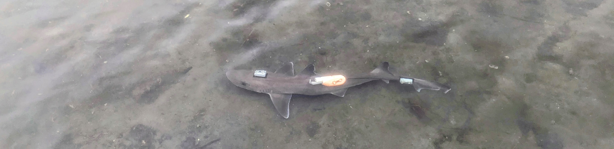
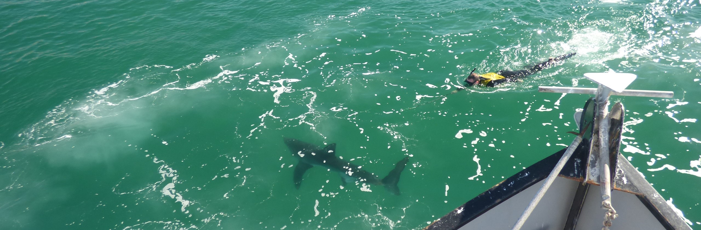
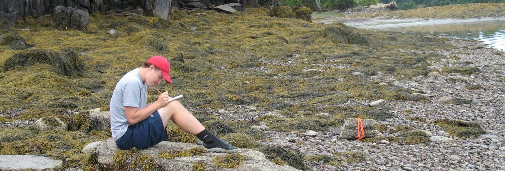

<link rel="stylesheet" href="styles.css" type="text/css">

 

## Doctorate

 

I finished my PhD in the winter of 2024 at Harvard University in the [Department of Organismic and Evolutionary Biology](https://oeb.harvard.edu/). During my time at Harvard I was a member of Dr. George Lauder's [Biomechanics and Hydrodynamics lab](https://www.people.fas.harvard.edu/~glauder/). My PhD work centered around how to bridge the gap between laboratory studies on the biomechanics of stereotyped behaviors and the diversity of behaviors that animals exhibit in the wild. To do this, I developed new methods that allow us to place multiple independent data loggers on a fish, release them into semi controlled or wild environments and allow us to fully reconstruct their movements in 3D. Using these methods I documented continuous  kinematics of free swimming sharks in the wild. During my time in the Lauder Lab, I also participated in a variety of experiments looking at fish swimming in disturbed flows, tuna sensory structures, and how body form affects the stability of fishes. 

 

## Masters

 

I graduated from [California State University Long Beach](https://www.csulb.edu/biological-sciences) with a MS in Biology in 2016. I was a member of Dr. Chris Lowes [shark lab](https://www.csulb.edu/shark-lab). I went to the Shark Lab in order to help develop autonomous underwater vehicles for shark tracking. I worked with engineers and computer scientists at Harvey Mudd College to implement multi vehicle autonomous tracking of leopard sharks. My thesis originally was going to use these AUVs to track leopard sharks with accelerometer data loggers on them, providing very fine scale spatio-temporal data, which I would then pair with fine scale environmental data I was collecting. However,the El Nino in 2015 changed this trajectory as leopard sharks were increasing rare. During my time at CSULB I managed the Southern California Juvenile White Shark tagging program. This allowed me to pivot and instead write my masters thesis on the habitat selection of juvenile white sharks. During my time at CSULB I work on and numerous other studies, with a large focus on using active and passive acoustic transmitters to track the movement of marine fishes.

 

## Undergrad

 

I graduated from the College of William and Mary with a BS in Biology in 2011. During my undergrad I was a member of [Dr. Jon Allens invertebrate life history ecology lab](https://wmpeople.wm.edu/site/page/jdallen/home). As part of Jons lab I spent a summer in Maine studying the egg clustering behavior of an intertidal gastropod and the subsequent fall working at the Virginia Institute of Marine Sciences field station at Wachapreague Island Studying crab-snail-oyster cascades. Both of these studies became my undergraduate masters thesis.

