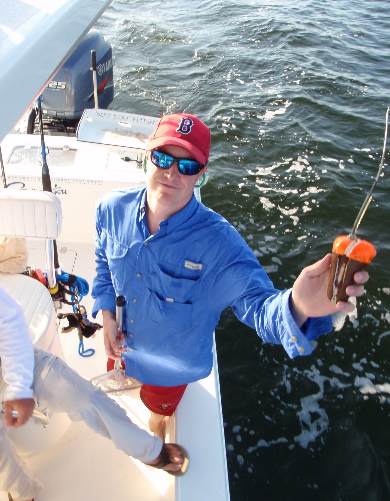

<link rel="stylesheet" href="styles.css" type="text/css">

### Harvard
I am working here now on biomechanics

### Anderson Cabot Center for Ocean Life at New England Aquarium

I worked here for a couple of years studying a diversity of topics, like red drum post release mortality, sea turtle nesting behavior, burmese python behavior, shore based fishing sand bar shark post release mortality, and long line fishing shark post release mortality

### Massachusetts Division of Marine Fisheries
I worked with Dr. Greg Skomal and Dr. Jeff Kneebone from New england aquarium to study juvenile sand tiger sharks in Boston Harbor

### Monterey Bay Aquarium
I worked with Dr. Sal Jorgenson on correcting accelerometer data from tags that were injested my white sharks

### Ecorp Consulting
I worked on a project studying barred sand bass and bay bass movements in reference to pile driving in San Diego Harbor

### California State University Long Beach
I worked on a diversity of projects, but mainly spent my time, developing autonomous vehicles to track sharks, and studying the movements of juvenile white sharks in Southern California.

### Mote Marine Laboratory

I first got involved in tagging animals at mote when I was an intern and then research technician with Dr. Nick Whitney. I worked on a project where we tagged Blacktip sharks using recreational fishing methods to assess the species post release mortality. From this project I became involved in other projects such as juvenile sea turtle behavior.

### Saltwater Inc.

After graduating, I worked as a fisheries Observer in the Alaskan groundfish fishery. I worked on commercial fishing boats of multiple gear types (bottom lonling, pot, trawl) sampling their catch for the National Marine Fisheries service

### William and Mary
During my undergrad, I studied intertidal snail egg clustering at Bowdoin Colleges Marine lab, and then the potential for trait mediated indirect interations between Blue crabs, oyster drill, and oysters at the Virginia Institute of Marine Sciences marine lab in Wachapreauge Virginia