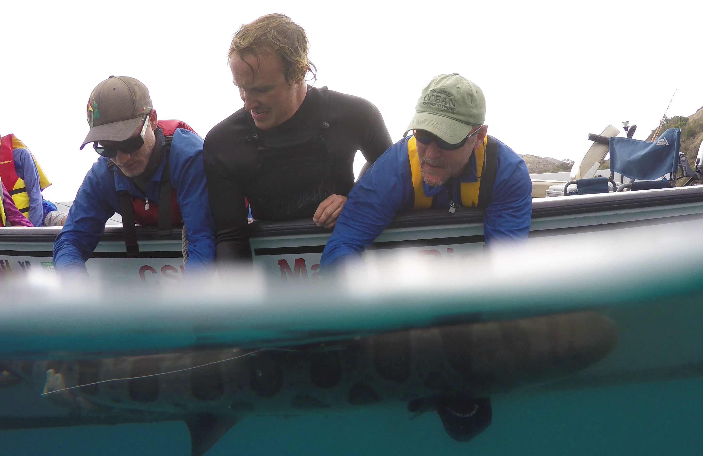

<link rel="stylesheet" href="styles.css" type="text/css">

 

Over the past 10 years I have been working on tagging marine animals to reveal how and why animals move and behave they way they do. By tracking animals spatial location using satellite and acoutic telemetry I have investigated *where* animals move, by attaching acceleration data loggers to animals we can understand *how* they move and *what* they do, and by attaching video cameras to animals we can understand the environment and stimuli that surrounds them. Yet to link these pieces of information together and create holistic and mechanistic understandings of how animals work and *why* they behave the way they do I try and integrate across fields such as physiology, biomechanics, ecology, environmental science and engineering. I love to develop new methodologies to answer questions that have been previously out of grasp. 
 
Currently, I am a post doctoral researcher at  [The University of Virginia](https://www.virginia.edu/).

My full CV is available [here](files/White CF_CV.pdf).