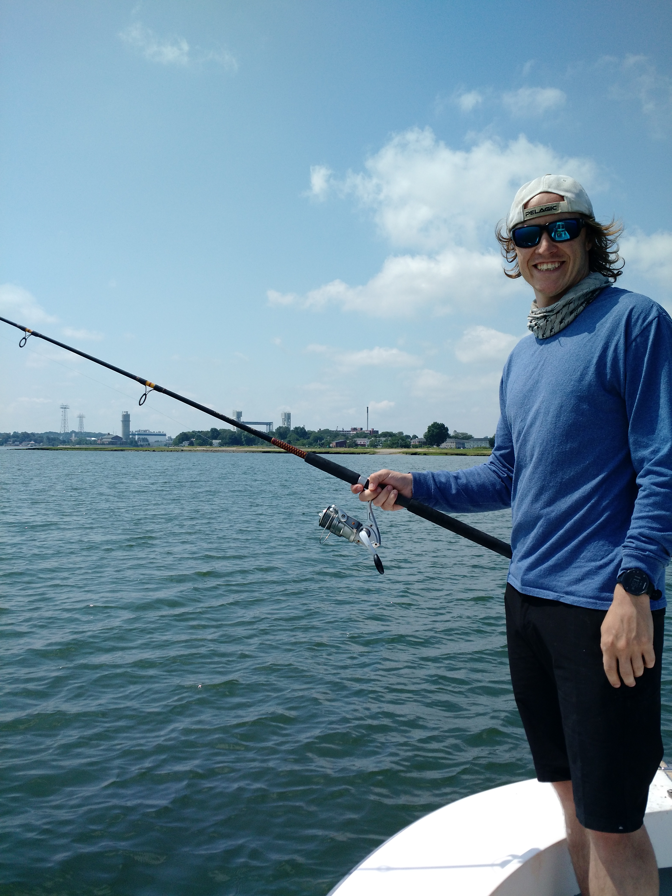

---
---

<link rel="stylesheet" href="styles.css" type="text/css">

Currently I am a graduate student in the [Department of Organismic and Evolutionary Biology at Harvard University](https://oeb.harvard.edu/). I am broadly interested in Ecology. My primary interests are using interdiscipliary approaches integrating technology to anwser questions about animal movement and behavior.

My full CV is available [here](files/White CF_CV.pdf).