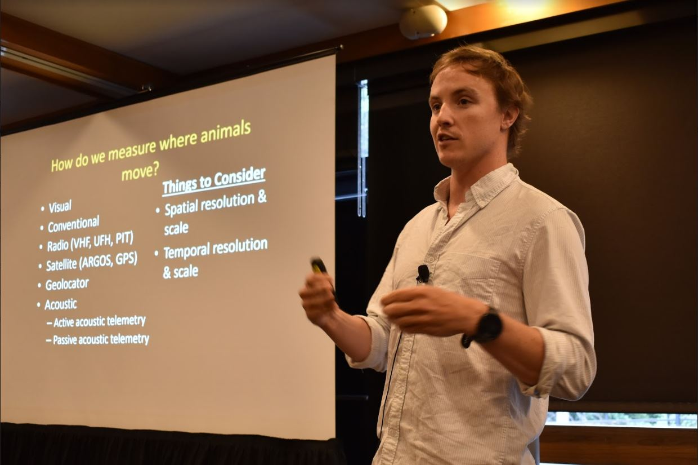
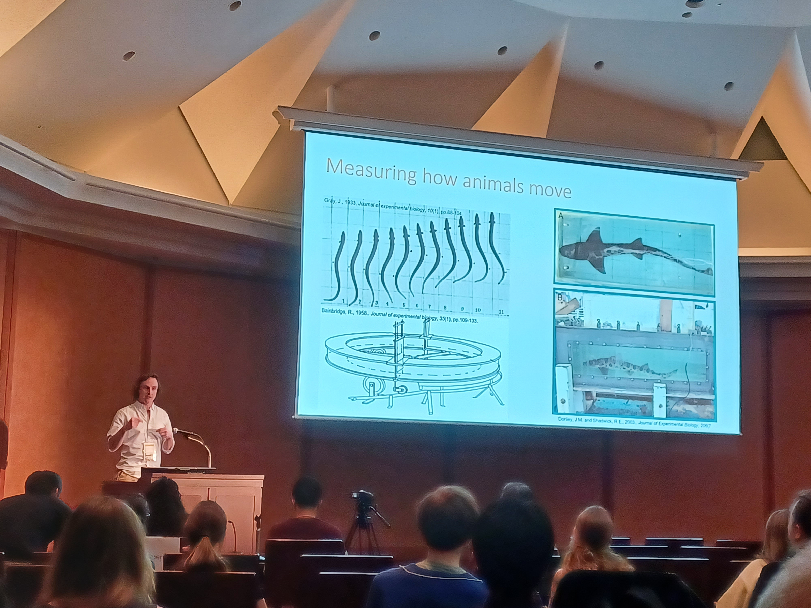

<link rel="stylesheet" href="styles.css" type="text/css">

* **White CF**, Lauder GV. 2024. Why stop at one? Using multiple IMU tags to reconstruct fish locomotion.  8th International Biologging Conference. Tokyo Japan.

* **White CF** 2023. Beyond the Lab: Using biologgers to understand fish locomotor behavior. G4 Symposium. Harvard University. [**Available**](https://youtu.be/3Q1hwtbIm4g)

* **White CF**, Castros-Santos T, Lauder GV 2023. Volitional burst swimming in White Sucker, *Catostomus commersonii*, quantified with high-resolution biologging. Society of Integrative and Comparative Biology. Austin Tx.

* **White CF**, Lear KO, Gleiss AC, Whitney NM. 2022. Scaling of tailbeat frequency with body size during volitional swimming in Sharks. Society of Integrative and Comparative Biology. Virtual Meeting. [**Available**](https://youtu.be/7Soj54R8gMc)

* **White CF**, Lauder GV 2021. Fish locomotion: reconstructing fish midline kinematics from multiple inertial measurement units. Society of Integrative and Comparative Biology. Virtual Meeting. [**Available**](https://youtu.be/IOppA3VxEo8)

* **White CF**, Whitney NM, Weber DN, Frazier BS. 2020. Survival and swimming behavior of red drum (*Sciaenops ocellatus*) following recreational capture and release. Society of Integrative and Comparative Biology. Austin TX.

* **White CF**, Clark CM, Lowe CG. 2019. Shark tracking robots: Development of autonomous Vehicles for tracking animals. American Elasmobranch Society. Snowbird UT.

* **White CF**, Moxley JH, Gleiss AC, Chapple TK, Kanive PE, Anderson SD, Carlisle AB, Block BA, Jorgensen SJ. 2017. Fine scale variability in stomach temperatures of white sharks (Carcharodon carcharias) links to digestion and homeothermy. 6th International Biologging Conference. Konstanz, Germany.

* **White CF**, Lyons K, Weng K, Winkler C, Jorgensen SJ, O'Sullivan J, Lowe CG. 2016. Movement of Juvenile White Sharks in Southern California: Predicting Future Nursery Habitat. Annual Meeting of the American Elasmobranch Society. New Orleans, LA.

* **White CF**, Lyons K, Weng K, Winkler C, Jorgensen SJ, O'Sullivan J, Lowe CG. 2016. Predicting the Distribution of Juvenile White Sharks Based on Dynamic Environmental Data. 2nd North East Pacific Shark Symposium. Catalina Island, CA.

* **White CF**, Lin Y, Hsiung J, Clark CM, Lowe CG. 2015. Evaluating Autonomous Underwater Vehicles As Tools for Surveying and Tracking Tagged Fish. 145th Annual Meeting of the American Fisheries Society. Portland, OR.

* **White CF**, Lin Y, Hsiung J, Clark CM, Lowe CG. 2015. Habitat Selection of the Leopard Shark, Triakis semifasciata, Using Fine Spatio-Temporal Movement and Temperature Data. American Elasmobranch Society. Reno, NV.

* **White CF**, Hart KM, Cherkiss MS, Rockford MR, Mazzotti FJ, Whitney NM. 2014. Activity Patterns and Thermoregulatory Behavior of the Invasive Burmese Python, Python molurus bivittatus, in the Florida Everglades , USA.  5th International Biologging Symposium. Strasbourg, France.

* **White CF**, Lin Y, Piersall R, Clark CM, Lowe CG. 2014. Using Tracking Robots and Accelerometers to Determine Fine Scale Behaviors and Habitat Selection of the Leopard Shark, Triakis semifasciata. First North East pacific Shark Symposium. Seattle, WA.

* **White CF**, Anderson PA, Gleiss AC, Skomal GB, Hueter RH, Whitney NM. 2013. Assessing Post-Release Recovery Periods in Blacktip Sharks. Annual Meeting of Western Society of Naturalists. Oxnard, CA.

* **White CF**, Allen JD. 2012. Embryo Protection in Nucella lapillus: Encapsulation or Aggregation? Benthic Ecology Meeting. Norfolk, VA.

* **White CF**, Allen JD. 2011. The Effect of Egg Capsule Clustering on Embryonic Survival in the Dogwhelk Nucella lapillus. Society of Integrative and Comparative Biology. Salt Lake City, UT. pp E266-E266.

## Contributed Presentations

* Hart KM, Iverson A, Whitney NM, **White CF**, Gredzens C, Shaver DJ. 2020. Acceleration data loggers reveal fine-scale behavior of adult female Kemp’s Ridleys during inter-nesting. South East Regional Sea Turtle Meeting. Corpus Christi TX.

* Nosal AP, Cartamil DP, Lam CH, Bellquist LF, Ben-Aderet NJ, **White CF**, Logan RK, Freedman RM, Lowe CG, Semmens BX, Hastings PA. 2019. Triennial Philopatry in the Eastern North Pacific Soupfin Shark (Galeorhinus galeus). American Elasmobranch Society. Snowbird UT

* Popp M, Wainwright DK, **White CF**, Bernal D, Lauder GV. 2019. Thresher shark tails: Denticle morphology in comparison to other pelagic sharks. Society of Integrative and Comparative Biology. Tampa, FL.

* Whitney NM, Lear KO, **White CF**. 2018. Bringing Data to the Surface: The Use of Acceleration Data Loggers to Study Post-Release Mortality. Annual Meeting of the American Fisheries Society. Atlantic City, NJ.

* Nemire-Pepe DA, Hart KM, Iverson AR, Fujisaki I, **White CF**, Whitney NM. 2018. Getting to the bottom: accelerometers elucidate diving behavior of female green sea turtles during inter-nesting periods. 103rd Annual meeting of the Ecological Society of America. New Orleans , LA.

* Nosal AP, Cartamil DP, Lam CH, Bellquist LF, Ben-Aderet NJ, **White CF**, Logan RK, Freedman RM, Lowe CG, Semmens BX, Hastings PA. 2017. Movement Ecology of the Soupfin Shark (Galeorhinus galeus) in the Eastern North Pacific. Sharks International Joao Pessoda, Brazil 2018

* Burns ES, **White CF**, Meese EN, Lowe CG. An all-inclusive Smart Tag combines active tracking, biologging, and animal motion sensors to observe the fine-scale, short term behavior and habitat use of juvenile white sharks. Sharks International Joao Pessoda, Brazil 2018

* Burns ES, **White CF**, Meese EN, Lowe CG. Smart tags: combining active tracking and biologging to capture the fine-scale, short-term behavior and habitat use of juvenile white sharks. North East Pacific Shark Symposium, Seattle WA, 2018

* Lowe CG, **White CF**, Logan RK, Meese EN, Burns ES, Clevenstine A, Winkler C, Jorgensen S. O'Sullivan J. Juvenile white shark nursery behavior and habitat use in southern california. Sharks International Joao Pessoda, Brazil 2018

* Moxley JH, **White CF**, Gleiss AC, Chapple TK, Kanive PE, Anderson SD, Jorgensen SJ. 2017 Development and assessment of a generalizable correction method and R package gRumble for orienting unfixed biologging devices in the stomach of white sharks. 6th Internaitonal Biologging Conference. Konstanz, Germany.

* Nosal AP, Cartamil DP, Lam CH, Bellquist LF, Ben-Aderet NJ, **White CF**, Logan RK, Freedman RM, Lowe CG, Semmens BX, Hastings PA. 2017. Movement Ecology of the Soupfin Shark (Galeorhinus galeus) in the Eastern North Pacific. 4th Annual International Fish Telemetry Conference. Cairns, Australia

* Lowe CG, **White CF**, Barilotti AB, Logan RK, Winkler C, Jorgensen SJ, O'Sullivan J. 2016. Beach babies – Nearshore Movement of Juvenile White Sharks off Southern California. Annual Meeting of the Western Society of Naturalists. Monterey, CA.

* Marshall H, Whitney NM, **White CF**, Bernal D, Gennari E, Johnson R, Fischer C, Skomal GB. 2016. The Stress Response and Recovery Behavior of the White Shark (Carcharodon carcharias) After Capture on Handline Gear. Annual Meeting of the American Elasmobranch Society. New Orleans, LA.

* Schweiterman GD, Lear K, Marshall H, Morris J, **White CF**, Hueter RH, Skomal GB, Whitney NM. 2016. Post-Release Mortality of Coastal Sharks in a Commercial Longling Fishery. Annual Meeting of the American Elasmobranch Society. New Orleans, LA.

* Logan RK, **White CF**, Barilotti AB, Lyons K, Winkler C, Jorgensen SJ, O'Sullivan J, Lowe CG. 2016. Quantifying the Movements and Behavior of Juvenile White Sharks in Southern California Using Acoustic Telemetry. 2ndNorth East Pacific Shark Symposium. Catalina Island, CA.

* McGarigal C, Luongo S, Logan RK, Barilotti AB, Crear D, Sawyna J, **White CF**, Lowe CG. 2016. Remote Underwater Video: Who’s That Shark? In: Second North East Pacific Shark Symposium. Catalina Island, CA.

* Lowe CG, **White CF**, Logan RK, Barilotti AB, Lyons K, Winkler C, Jorgensen SJ, O'Sullivan J. 2015. Quantifying the Movements and Behavior of Juvenile White Sharks in Southern California using Different Electronic Tags. In: California Cooperative Oceanic Fisheries Investigations Conference. Moss Landing, CA.

* Halprin D, Barilotti AB, **White CF**. 2015. Acoustic Tracking of Sand Bass (Paralabrax spp.) During Pile Driving in San Diego Bay, CA. 145th Annual Meeting of the American Fisheries Society. Portland, OR.

* Barilotti AB, **White CF**, Lowe CG. 2015. Assessing Pier Association and Long-Term Movements of California Halibut (Paralichthys californicus) and White Croaker (Genyonemus lineatus). 145th Annual Meeting of the American Fisheries Society. Portland, OR.

* Clark CM, Lin Y, Hsiung J, **White CF**, Lowe CG. 2015. Planning, Control, and State Estimation for Animal Tracking with Autonomous Robots. In: Annual Meeting of the American Elasmobranch Society. Reno, NV.

* Lowe CG, **White CF**, Hight B, Bernal D. 2015. Behavioral Thermoregulation in Elasmobranch Fishes: What do we know and where do we go from here? Annual Meeting of the American Elasmobranch Society. Reno, NV.

* Marshall H, **White CF**, Lear K, Hueter RH, Skomal GB, Whitney NM. 2015. Stress Physiology and Post-Release Mortality Rates of Eight Species of Coastal Shark After Longline Capture. In: Tuna Conference. Lake Arrowhead, CA.

* Lowe CG, Lyons K, Winkler C, **White CF**, Jorgensen SJ, O'Sullivan J. 2014. Movement Patterns, Habitat Use, and Fishery Interactions of Juvenile White Sharks in Southern California. In: First North East Pacific Shark Symposium. Seattle, WA.

* Whitney NM, **White CF**, Anderson PA, Gleiss AC, Skomal GB, Lear K. 2014. Hook, Line and Sinker? Accelerometers to Assess Post-Release Mortality and Recovery Periods in Coastal Sharks. Fifth International Biologging Conference Strasbourg, France.

* Hart KM, Whitney NM, Sartain AR, **White CF**. 2013. Assessing Fine-Scale Activity and Behaviors of Juvenile Green Turtles in Dry Tortugas National Park, Florida, USA. In: 16th Annual Florida Marine Turtle Permit Holder Meeting. Orlando, FL.

* Whitney NM, **White CF**, Anderson PA, Gleiss AC, Skomal GB, Hueter RH. 2013. Hook, Line and Sinker? Using Accelerometers to Assess Post-Release Behaviors in Sharks. In: Annual meeting of the American Elasmobranch Society. Albuquerque, NM

* Whitney NM, Randall M, Sulak KJ, **White CF**. 2012. Why do Sturgeon Jump? New Technology to Address an Ancient Question. 142nd Annual Meeting of the American Fisheries Society. Minneapolis-St. Paul, MN.

