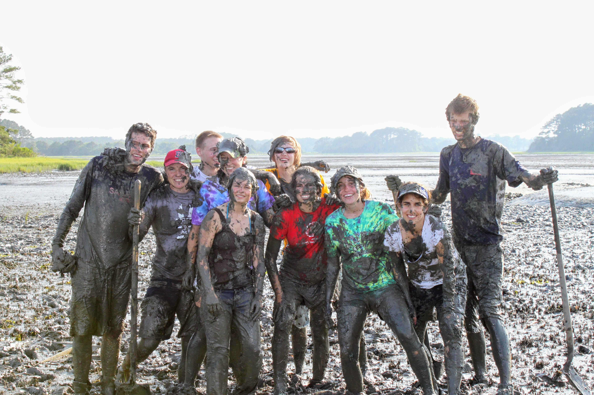

<link rel="stylesheet" href="styles.css" type="text/css">

### Mentor

* **Resident Tutor** , Lowell House, Harvard University
  * From Fall 2017 through present I have been a resident tutor at Lowell House, one of the dorms at Harvard College. I live in the building with students where I am additional resource and daily interact with a wide range of students where I provide advice on both academic and personal matters. Within the house I am in charge of the intermural program, as well as part of the Fellowship team and the Lowell Speeches Program.

 

 

### Classes

* **Evolutionary Human Anatomy and Physiology** (LS2), Harvard University
  * During Fall of 2020 I worked as a grading assistant for Dr. George Lauder, Dr. Dan Leiberman, and Dr. Andrew  Bieweiner. This course is designed as an introductory anatomy and Physiology. I worked as a grader during the transistion to online learning, where I weekly graded 160 short anwser (20 sentence) questions.

* **Biology of Fishes** (OEB 130), Harvard University
  * During Spring of 2018 I worked as a teaching assistant for Dr. George Lauder providing an overview of fish Biology. This was a course of approximately 60 primarily upperclass students. As a broad course we discussed fish anatomy, physiology, evolution and behavior. I led students in a weekly fish disesction.

* **Fisheries Science** (OSI 431), The Ocean Institute, California State University
  * During the fall of 2015 I worked as a teaching assistant for Dr. Chris Lowe 4 week field fisheries science class. This was during a field semester with students living at the University of Southern California's Wrigley field station on Catalina Island. I mainly led students in lab based dissections as well as field excersizes to learn fish ID, as well as field methods such as snorkle transects and boat driving.

* **Marine Community Ecology** (OSI 421), The Ocean Institute, California State University
   * During the fall of 2015 I worked as a teaching assistant for Dr. Bengt Allens 4 week field Marine Ecology class. This was during a field semester with students living at the University of Southern California's Wrigley field station on Catalina Island. I led students in lab excersizes as well as field studies, like inter and sub tidal transects and species ID

   
* **Directed Research (OSI 490)**, The Ocean Institute, California State University
  * During the last 4 weeks of students Catalina Semester students were in charge of conducting their own field research project which was ultimately presented as their final project. I aided students in study design, field research, statistical analysis, and results writing.

* **Marine Biology** (Bio 153), California State University Long Beach
  * During the fall of 2013 I worked as a teaching assistant for Dr. Gwen Goodman-Lowe, teaching 2 sections of this class. This class was designed to be an introductory class to marine biology for non scientists. I mainly led students in weekly field trips to field sites to conduct hands on experiments in different marine environments(e.g. Marsh, beach, mudflat)

* **Biological Statistics** (Bio 260), California State University Long Beach
  * During the Spring and Fall  of 2014 I worked as a teachign assistant for Dr. Darren Johnson teaching 2 sections of this class each semester. As a introductory statistics class, I led a computer lab section, where I taught students in the implementation of the concepts learned in lecture. I taught students how to use minitab to analyze biological data(i.e. t-test, ANOVA, regression)

### Workshops
* **R for Biologists** , Harvard University
  * During the summer of 2020 I virtually led summer REU students(~10) in a weekly workshop, where I taught them an introduction to R. I taught students how to bring data into r, manipulate data, plot data, and statistically analyze data.

